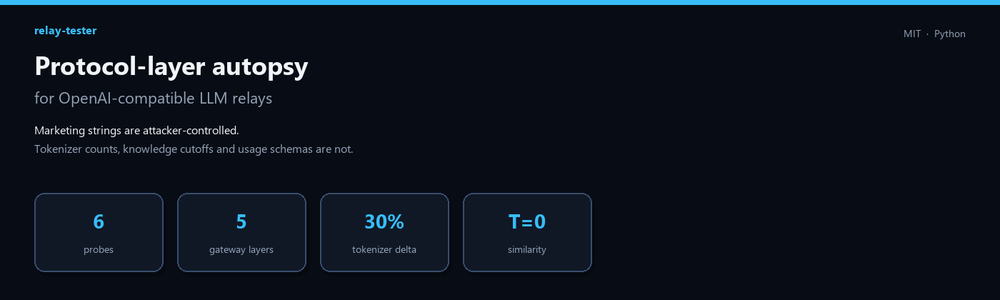
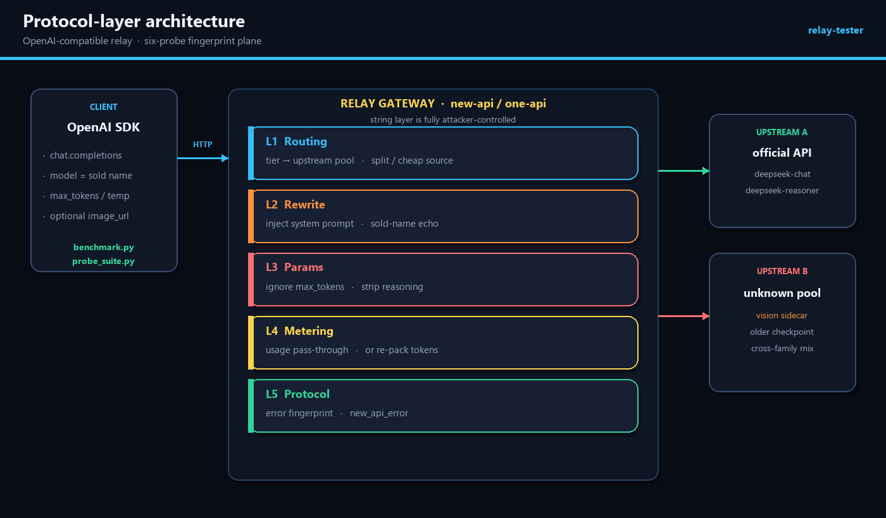
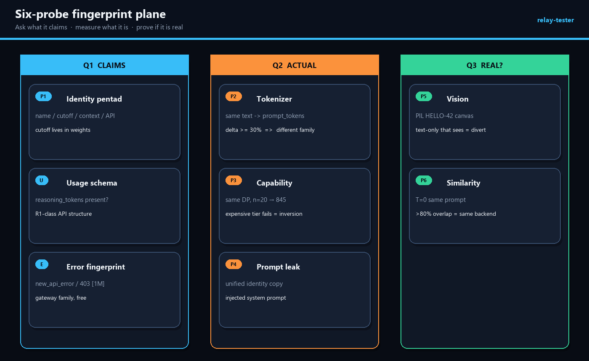
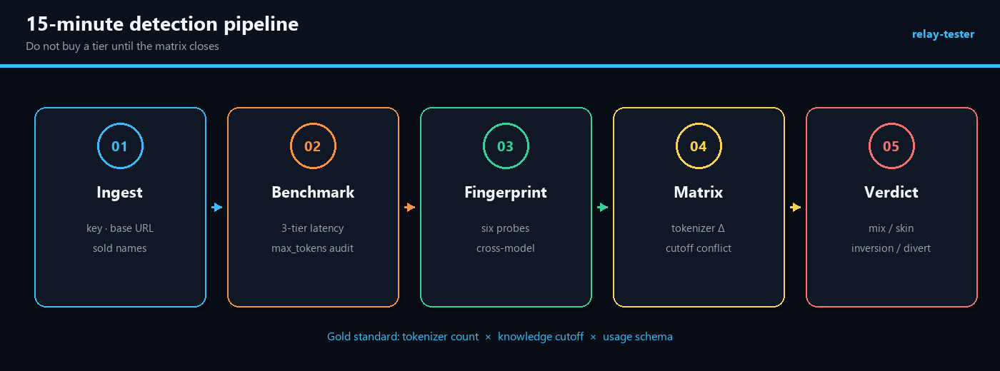
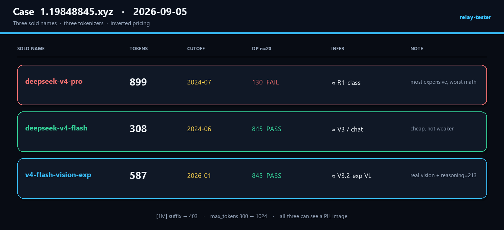

# relay-tester

<p align="center">
  
</p>

<p align="center">
  <a href="https://github.com/jinyimeng01/relay-tester/blob/main/LICENSE"></a>
  
  
  
  
</p>

**Marketing strings are attacker-controlled. Tokenizer counts, knowledge cutoffs, and `usage` schemas are not.**

`relay-tester` is a protocol-layer autopsy kit for any OpenAI-compatible (and Anthropic-compatible) LLM relay. It does not trust the sold model name. It measures the **behavior the gateway is forced to forward** — then closes a fingerprint matrix.

| You think you bought | The protocol actually exposes |
|----------------------|-------------------------------|
| `deepseek-v4-pro` | tokenizer family, knowledge cutoff, `reasoning_tokens` schema |
| `[1M]` context | registration name, 403 on the marketing suffix, self-reported window |
| “most expensive = strongest” | same DP problem across tiers (inversion is visible) |
| “pure-text R1/V3” | whether a PIL canvas is described anyway (diversion / hidden VL) |

Companion long-form writeup (Chinese, Mermaid-first):
[三个 DeepSeek-V4，tokenizer 差了三倍：LLM 中转站协议层开膛与全维指纹检测](https://github.com/jinyimeng01/relay-tester) · vault copy in `2文章研究/01-已发布/LLM中转站指纹检测完全指南/index.md`

---

## Architecture — five layers the gateway can lie on

<p align="center">
  
</p>

The sold `model` field is an **echo**. It proves registration, not identity.

| Layer | What the gateway controls | What still leaks |
|-------|---------------------------|------------------|
| L1 Routing | which upstream a tier hits | capability inversion across tiers |
| L2 Rewrite | system prompt, sold-name echo | unified identity copy (leak probe) |
| L3 Params | `max_tokens`, stripped `reasoning_content` | contract violations |
| L4 Metering | `usage` pass-through **or** re-pack | `prompt_tokens` as tokenizer fingerprint; re-pack is itself evidence |
| L5 Protocol | error envelope | `new_api_error` ⇒ new-api / one-api family |

**Integrity paradox.** To stay usable the gateway must forward real model behavior. To cheat it must rewrite identity and parameters. Forward more → stronger fingerprints. Rewrite more → more contract evidence. It cannot have both.

---

## Fingerprint plane — six probes, three questions

<p align="center">
  
</p>

| ID | Probe | Gold-standard? | Alone enough? | Cross-check |
|----|--------|:--------------:|:-------------:|-------------|
| P1 | Identity pentad (name / cutoff / context / official API / bias) | cutoff **yes** | cutoff yes | P2 |
| P2 | Tokenizer — same pangram → `usage.prompt_tokens` | **yes** | family yes | P1 cutoff |
| P3 | Capability gradient — broken-stair DP, `n=20` → **845** | no | needs cross-tier | P6 |
| P4 | System-prompt leak / unified copy | no | circumstantial | all |
| P5 | Vision — PIL canvas `HELLO-42` | no | needs official card | P1 claim |
| P6 | Similarity — T=0, same short prompt, prefix overlap | no | suspicion only | P2 |

**Decision law:** never convict on a single probe. Tokenizer Δ ≥ 30% plus mutually exclusive cutoffs is mix-and-match, not a skin. Tokenizer homology plus T=0 overlap is the same backend.

Cutoff dates in the lookup table drift when vendors ship new cards. Relative comparison on the **same day, same site** still holds: same sold family with conflicting cutoffs is assembly.

---

## Pipeline — 15 minutes, then buy (or don’t)

<p align="center">
  
</p>

```text
ingest  →  benchmark (3-tier × N)  →  six probes (all sold names)
        →  matrix (tokenizer Δ × cutoff × usage schema)
        →  verdict (mix / skin / inversion / diversion / metering)
```

Gold standard intersection: **tokenizer count × knowledge cutoff × usage schema**.

---

## Install

```bash
git clone https://github.com/jinyimeng01/relay-tester.git
cd relay-tester
pip install -r requirements.txt   # openai (required) · pillow (vision probe)
```

Python 3.10+. Keys from the environment — never in the repo:

| Flag | Env fallback |
|------|----------------|
| `--api-key` | `ANTHROPIC_AUTH_TOKEN` or `OPENAI_API_KEY` |
| `--base-url` | `ANTHROPIC_BASE_URL` or `OPENAI_BASE_URL` |
| `--model` | `ANTHROPIC_DEFAULT_FABLE_MODEL` or `LLM_MODEL` |

`--base-url` may omit `/v1` (the scripts append it). Sold names with `[1M]` are stripped before the request; the suffix is still evidence.

---

## Usage

```bash
# 1) Speed + metering  —  trust only the long tier for tok/s
python benchmark.py --api-key "$KEY" --base-url https://your-relay.com/v1 \
                    --model your-model --rounds 3

# 2) Six-probe autopsy  —  pass EVERY sold tier; cross-model is the point
python probe_suite.py --api-key "$KEY" --base-url https://your-relay.com/v1 \
                      --models model-a,model-b,model-c
```

`probe_suite.py` writes `probe_report.json` (gitignored).

### How to read `benchmark.py`

| Tier | What it measures | What it is not |
|------|------------------|----------------|
| short / medium | TTFT-dominated | **not** throughput |
| **long** (≥300 tok) | the only honest tok/s | — |
| `max_tokens_violated` | `completion_tokens > expect × 1.5` | systematic ignore, not a 20-token overrun |

Streaming TTFB is a separate number. Do not fold queue delay into tok/s.

---

## Field case — `https://1.19848845.xyz` (2026-09-05)

<p align="center">
  
</p>

Single-day sample. Direction is stable; exact numbers are for reproduction.

| Sold name | `prompt_tokens` | Cutoff | DP 845 | Inference (interval, not a checkpoint) |
|-----------|----------------:|:------:|:------:|----------------------------------------|
| `deepseek-v4-pro` | **899** | 2024-07 | **130 FAIL** | ≈ R1-class reasoner |
| `deepseek-v4-flash` | **308** | 2024-06 | 845 PASS | ≈ V3 / `deepseek-chat` |
| `v4-flash-vision-exp` | **587** | 2026-01 | 845 PASS | ≈ V3.2-exp-class VL |

Also: `[1M]` suffix → **403**; self-report 128K; `max_tokens=300` → **1024**; all three describe a synthetic image (official V3/R1 are text-only). Error envelope: `new_api_error`.

Full narrative: [`report_案例_1.19848845.xyz.md`](report_案例_1.19848845.xyz.md)

---

## Threat model (what this is / is not)

| This tool | This tool is not |
|-----------|------------------|
| Talks to an endpoint **you already hold a paid key for** | A port scanner, crawler, or unauth tester |
| Measures chat-completion behavior | An exploit, jailbreak pack, or billing bypass |
| Emits interval inferences (`≈ R1-class`) | A courtroom identity of a checkpoint |
| Treats errors as fingerprints | “The probe failed, discard the site” |

Do not send secrets, source, or documents through a relay you have not autopsied. Vision diversion is a privacy signal, not a reason to upload a real passport “to confirm”.

---

## Reproduce the diagrams

```bash
pip install pillow
python docs/render_architecture.py   # writes docs/img/*.png
```

---

## Layout

```text
relay-tester/
├── benchmark.py                 # 3-tier latency + max_tokens audit
├── probe_suite.py               # 6-probe fingerprint suite
├── requirements.txt
├── report_案例_1.19848845.xyz.md
├── docs/
│   ├── render_architecture.py
│   └── img/                     # hero · architecture · probes · pipeline · case
└── LICENSE                      # MIT
```

---

## Ethics

Requests in the bundled case used an author-owned, paid key against a public compatible endpoint. Relays may change routing at any time. Brand names remain with their owners. Do not commit `.env`, raw keys, or `probe_report.json`.
